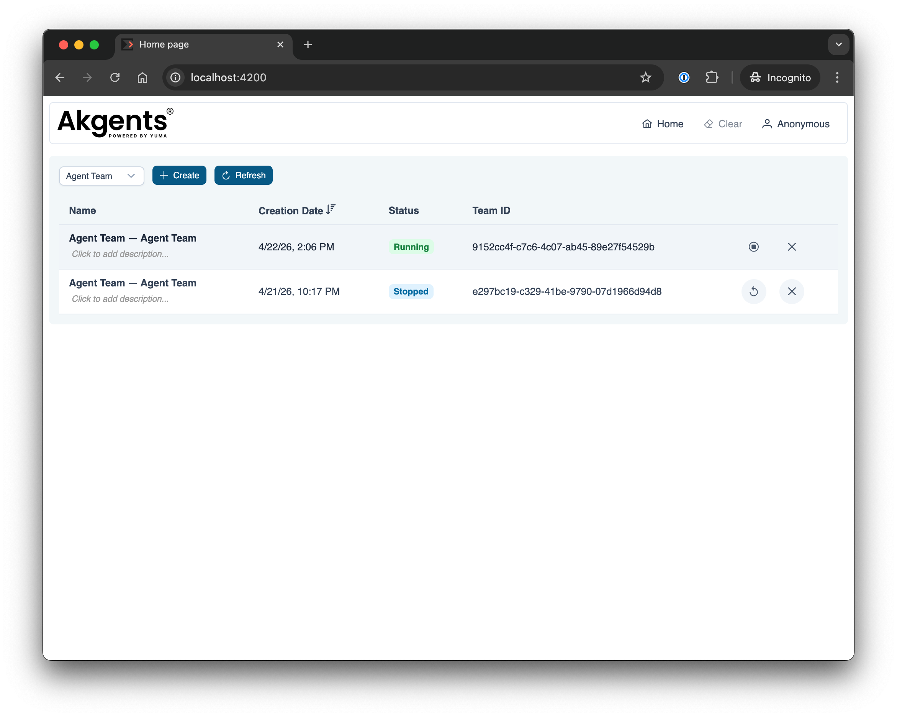
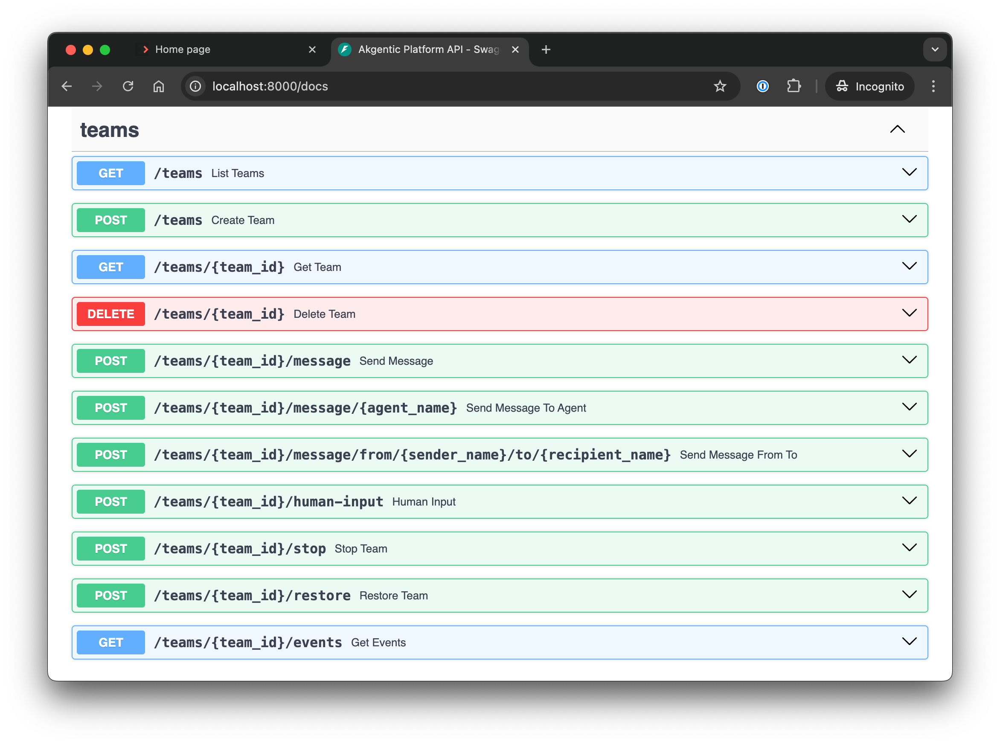

# Akgentic Framework Quick Start Guide

**Modern actor-based agent framework for Python 3.12+**

A comprehensive framework for building intelligent multi-agent systems with LLM integration, dynamic team composition, and actor-based architecture.

| Package | CI | Coverage | Dependencies |
|---|---|---|---|
| [akgentic-core](https://github.com/b12consulting/akgentic-core) <br> Actor framework, messaging, and orchestrator | [](https://github.com/b12consulting/akgentic-core/actions/workflows/ci.yml) | [](https://github.com/b12consulting/akgentic-core/actions/workflows/ci.yml) | — |
| [akgentic-llm](https://github.com/b12consulting/akgentic-llm) <br> Multi-provider LLM integration and REACT pattern | [](https://github.com/b12consulting/akgentic-llm/actions/workflows/ci.yml) | [](https://github.com/b12consulting/akgentic-llm/actions/workflows/ci.yml) | — |
| [akgentic-tool](https://github.com/b12consulting/akgentic-tool) <br> Tool abstractions, workspace, planning, web search, MCP, ... | [](https://github.com/b12consulting/akgentic-tool/actions/workflows/ci.yml) | [](https://github.com/b12consulting/akgentic-tool/actions/workflows/ci.yml) | core |
| [akgentic-team](https://github.com/b12consulting/akgentic-team) <br> Team lifecycle, event sourcing, YAML/MongoDB persistence | [](https://github.com/b12consulting/akgentic-team/actions/workflows/ci.yml) | [](https://github.com/b12consulting/akgentic-team/actions/workflows/ci.yml) | core |
| [akgentic-agent](https://github.com/b12consulting/akgentic-agent) <br> LLM-powered agents with typed message routing | [](https://github.com/b12consulting/akgentic-agent/actions/workflows/ci.yml) | [](https://github.com/b12consulting/akgentic-agent/actions/workflows/ci.yml) | core, llm, tool |
| [akgentic-catalog](https://github.com/b12consulting/akgentic-catalog) <br> Configuration registry for teams, YAML/MongoDB persistence | [](https://github.com/b12consulting/akgentic-catalog/actions/workflows/ci.yml) | [](https://github.com/b12consulting/akgentic-catalog/actions/workflows/ci.yml) | core, llm, tool, team |
| [akgentic-infra](https://github.com/b12consulting/akgentic-infra) <br> Infrastructure backend — protocol abstractions, community/department/enterprise tiers | [](https://github.com/b12consulting/akgentic-infra/actions/workflows/ci.yml) | [](https://github.com/b12consulting/akgentic-infra/actions/workflows/ci.yml) | core, llm, tool, agent, catalog, team |
| [akgentic-frontend](https://github.com/b12consulting/akgentic-frontend) <br> Angular-based web UI | — | — | — |

## Quick Start

This root package serves as the **quick-start entry point** for the Akgentic framework, providing complete examples that demonstrate the full capabilities of multi-agent team coordination.

### Installation

```bash
# 1. Clone the repository with submodules
git clone https://github.com/b12consulting/akgentic-framework.git
cd akgentic-framework

# 2. Create and activate virtual environment
uv venv
source .venv/bin/activate  # On Windows: .venv\Scripts\activate

# 3. Install all workspace packages in editable mode
uv sync --all-packages --all-extras
```

### Running the Server and Frontend

After installation, open two terminals to launch the backend and the web UI:

**Terminal 1 — Start the backend server:**

```bash
source .venv/bin/activate

# Set your API keys (get them from https://platform.openai.com/api-keys and https://app.tavily.com/)
export OPENAI_API_KEY="your-openai-api-key"
export TAVILY_API_KEY="your-tavily-api-key"

# Launch the server (param --logfire enables structured logging, https://logfire-eu.pydantic.dev/)
python src/infra_server.py
```

**Terminal 2 — Start the web UI:**

```bash
cd packages/akgentic-frontend
npm install
npm start
```

Once both are running:

- **Web UI** — [http://localhost:4200](http://localhost:4200) — create and interact with agent teams visually
- **API docs** — [http://localhost:8000/docs](http://localhost:8000/docs) — interactive OpenAPI (Swagger) interface to explore and test all REST endpoints

By default, the server stores team catalogs in `./data/catalog/` and the event store in `./data/event_store/`. These paths are configurable via the `CommunitySettings` class or environment variables prefixed with `AKGENTIC_`.





### Command line Agent Team Example

The [src/agent_team/main.py](src/agent_team/main.py) example demonstrates a complete multi-agent team system from a simple python script without the full infrastructure.

**What it demonstrates:**

- Building a team with Manager, Assistant, and Expert roles using `AgentCard`
- Interactive chat loop with `@mention` routing (e.g., `@Expert help me`)
- `HumanProxy` for human-to-agent communication
- `EventSubscriber` for real-time message flow visibility
- Dynamic team composition (Manager can hire Assistant/Expert on demand)
- Slash commands: `/team`, `/roles`, `/planning`, `/hire <role>`, `/fire <name>`

**Team Structure:**

- **Manager**: Coordinates team, can hire Assistant and Expert roles
- **Assistant**: Provides support and research
- **Expert**: Provides specialized knowledge
- **HumanProxy**: Routes human input to Manager

**Key Concepts:**

- `AgentCard` — Defines agent roles with skills, prompts, and `routes_to` restrictions
- `BaseAgent` — LLM-powered agent with typed `AgentMessage` protocol
- `register_agent_profiles()` — Registers `AgentCard` catalog with orchestrator
- `EventSubscriber.on_message()` — Event-driven message monitoring
- `HumanProxy.send()` — Sends `AgentMessage` from human to agents
- `cmd_get_team_roster()` — Retrieves current team roster programmatically

**Run the example:**

```bash
# Set your OpenAI and TAVILY API key
export OPENAI_API_KEY="your-openai-api-key" # https://platform.openai.com/api-keys
export TAVILY_API_KEY="your-tavily-api-key" # https://app.tavily.com/

# Activate the environment
source .venv/bin/activate

# Run the team example
python src/agent_team/main.py
```

**Interactive Features:**

In this example, as a human user, we instruct the manager to ask the expert (`@Expert`) about his role in the team. The manager routes an `AgentMessage(request)` to the expert, who replies with `AgentMessage(response)`. The manager then relays the answer back to the human.

By default messages are addressed to the Manager, but you can route them to specific agents using `@AgentName` prefix — e.g., `@Expert what is your role?` sends directly to the Expert. Use `/help` to see all available slash commands.

```
Team members:
  - @Human (Human)
  - @Manager (Manager)
  - @Assistant (Assistant)
  - @Expert (Expert)

Type your message (start the message with @{agent_name} to route to specific agent, 'exit' to quit or '/help' for help):
----------------------------------------------------------------------------------------------------
Ask @Expert what is his role in the team

----------------------------------------------------------------------------------------------------
[@Manager] -> AgentMessage(request) [@Expert]:
You received a request from @Manager:

Could you please describe your role and main responsibilities within the team?

----------------------------------------------------------------------------------------------------
[@Manager] -> AgentMessage(response) [@Human]:
I'll reach out to @Expert to clarify his role in the team.

----------------------------------------------------------------------------------------------------
[@Expert] -> AgentMessage(response) [@Manager]:
You received a response from @Expert:

Certainly, @Manager. As the Expert within the team, my primary role is to provide deep, specialized knowledge and technical guidance. My responsibilities include:

1. Offering in-depth analysis and solutions for complex problems...

----------------------------------------------------------------------------------------------------
[@Manager] -> AgentMessage(response) [@Human]:
@Human, here is @Expert's response regarding his role:

As the Expert, his primary role is to provide deep, specialized knowledge and technical guidance. His responsibilities include:

1. Offering in-depth analysis and solutions for complex problems...


exit

Exiting chat loop.
```

This example showcases the **akgentic-agent** package capabilities. For LLM-driven agent patterns and the typed message protocol, see [packages/akgentic-agent/README.md](packages/akgentic-agent/README.md).

### Catalog-Driven Agent Team Example

The [src/catalog/main.py](src/catalog/main.py) example builds the same multi-agent team, but every definition — prompt templates, tools, agents, and team structure — comes from YAML files in `src/catalog/` loaded via the **akgentic-catalog** package.

Instead of defining `AgentCard` objects in Python, you declare them in YAML catalogs and resolve them at runtime through `TemplateCatalog`, `ToolCatalog`, `AgentCatalog`, and `TeamCatalog`. This enables configuration-driven team composition without code changes.

```bash
python src/catalog/main.py
```

See [packages/akgentic-catalog/README.md](packages/akgentic-catalog/README.md) for catalog documentation.

## Architecture

This is a **monorepo workspace** containing seven core packages:

```
packages/
  akgentic-core/        → Zero-dependency actor framework (Pykka, messaging, orchestrator)
  akgentic-llm/         → LLM integration layer (pydantic-ai, multi-provider, REACT pattern)
  akgentic-tool/        → Tool abstractions (ToolCard, ToolFactory, workspace, planning, search, KG, MCP)
  akgentic-agent/       → Collaborative agent patterns (BaseAgent, typed message protocol, HumanProxy)
  akgentic-catalog/     → Configuration registry (YAML-driven CRUD catalogs)
  akgentic-team/        → Team lifecycle management (create/resume/stop/delete, event sourcing)
  akgentic-infra/       → Infrastructure backend (three-tier: community, department, enterprise)
  akgentic-frontend/    → Angular web UI (REST + WebSocket client for akgentic-infra)
```

**Dependency graph** (lower layers have no upward dependencies):

```
akgentic-frontend ──depends on──>  akgentic-infra (REST + WebSocket API)
akgentic-infra    ──depends on──>  akgentic-core + akgentic-llm + akgentic-tool + akgentic-agent + akgentic-catalog + akgentic-team
akgentic-catalog  ──depends on──>  akgentic-core + akgentic-llm + akgentic-tool + akgentic-team
akgentic-team     ──depends on──>  akgentic-core (only)
akgentic-agent    ──depends on──>  akgentic-core + akgentic-llm + akgentic-tool
akgentic-tool     ──depends on──>  akgentic-core + (pydantic, pydantic-ai, tavily-python, httpx)
akgentic-llm      ──depends on──>  (pydantic-ai, httpx, tenacity)
akgentic-core     ──depends on──>  (pydantic, pykka)  ← zero infrastructure deps
```

### akgentic-core

Core actor framework with zero infrastructure dependencies.

**Features:**

- **Actor-Based Architecture** - Scalable message-passing concurrency model
- **Type-Safe Messaging** - Pydantic-validated message definitions
- **Orchestrator Pattern** - Centralized agent coordination and event observation
- **AgentCard System** - Role-based agent definitions and dynamic hiring
- **In-Memory Execution** - Fast, testable, and easy to deploy

**Quick Example:**

```python
from akgentic.core import ActorSystem, Akgent
from akgentic.core.messages import Message

class EchoMessage(Message):
    content: str

class EchoAgent(Akgent):
    def receiveMsg_EchoMessage(self, message: EchoMessage, sender):
        print(f"Received: {message.content}")

system = ActorSystem()
agent = system.createActor(EchoAgent)
system.tell(agent, EchoMessage(content="Hello!"))
```

See [packages/akgentic-core/README.md](packages/akgentic-core/README.md) for full documentation.

### akgentic-llm

LLM integration layer supporting OpenAI, Anthropic, Google, and more.

**Features:**

- **Multi-Provider Support** - OpenAI, Azure, Anthropic, Google, Mistral, NVIDIA
- **REACT Pattern** - Reasoning and Acting with tool execution
- **Usage Limits** - Cost control and safety with granular token limits
- **HTTP Retry Logic** - Production-grade reliability with configurable backoff
- **Context Management** - Checkpointing, rewind, and compactification
- **Dynamic Prompts** - Programmatic system prompt registry

See [packages/akgentic-llm/README.md](packages/akgentic-llm/README.md) for details.

### akgentic-tool

Tool infrastructure and domain tool implementations.

**Features:**

- **ToolCard / ToolFactory** — Pydantic-serializable tool definitions; factory aggregates cards into LLM-callable tools, system prompts, and programmatic commands
- **3-Channel System** — `TOOL_CALL` (LLM invokes), `SYSTEM_PROMPT` (injected context), `COMMAND` (programmatic API)
- **WorkspaceTool** — Read/write filesystem access with glob, grep, edit, patch, PDF/image reading
- **PlanningTool** — Shared actor-based task board with semantic search
- **KnowledgeGraphTool** — Persistent entity/relation storage with hybrid search
- **SearchTool** — Tavily web search and content fetching
- **MCPTool** — Model Context Protocol server integration (HTTP+SSE and stdio)
- **RetriableError** — Framework-agnostic retry signal for recoverable failures

See [packages/akgentic-tool/README.md](packages/akgentic-tool/README.md) for complete documentation.

### akgentic-agent

Collaborative agent patterns — the integration layer combining core, llm, and tool.

**Features:**

- **BaseAgent** — LLM-powered agent composing `ReactAgent` and `ToolFactory`
- **Typed Message Protocol** — 5-type intent system (`request`, `response`, `notification`, `instruction`, `acknowledgment`)
- **Intent-Driven Routing** — LLM chooses recipients and message types via `StructuredOutput`; schema-constrained recipients prevent invalid routing
- **Dynamic Team Composition** — Hire/fire agents by role at runtime
- **HumanProxy** — Seamless human-in-the-loop interactions
- **Media Expansion** — `!!file.png` and `!!*.md` inline file injection into LLM prompts

See [packages/akgentic-agent/README.md](packages/akgentic-agent/README.md) for complete documentation.

### akgentic-catalog

Configuration-driven team assembly from YAML files — no code changes needed.

**Features:**

- **Four Catalogs** — `TemplateCatalog`, `ToolCatalog`, `AgentCatalog`, `TeamCatalog`; each with full CRUD
- **YAML / MongoDB backends** — File-per-entry YAML (default) or MongoDB collection
- **Cross-catalog validation** — Agent entries reference tool entries by name; team entries reference agent entries
- **Delete protection** — Prevents removing entries still referenced by others
- **FQCN resolution** — Resolve `"akgentic.agent.BaseAgent"` to the actual class at runtime
- **CLI + REST API** — `ak-catalog` CLI and FastAPI REST layer for all CRUD operations

See [packages/akgentic-catalog/README.md](packages/akgentic-catalog/README.md) for complete documentation.

### akgentic-team

Team lifecycle management with crash-recovery and event sourcing.

**Features:**

- **TeamManager** — Create, resume, stop, delete teams via a lifecycle facade
- **Event Sourcing** — Events persisted live as they flow; crash recovery without explicit checkpoints
- **TeamCard** — Declarative team definition (agents, entry point, supervisors)
- **YAML / MongoDB stores** — Zero-infra default (YAML), scalable alternative (MongoDB via `[mongo]` extra)
- **Resume from any STOPPED team** — Rebuild LLM conversation history from event replay log

See [packages/akgentic-team/README.md](packages/akgentic-team/README.md) for complete documentation.

### akgentic-infra

Infrastructure backend for the Akgentic platform. Provides protocol abstractions that decouple the server and CLI from any specific deployment model, available in three tiers:

| Tier | Target | Key characteristics |
|---|---|---|
| **Community** | Single process | `NoAuth`, local placement, YAML event store, local filesystem — zero external dependencies |
| **Department** | Docker Compose | OAuth2 + API key, Redis-backed cache and channels, MongoDB persistence, HTTP remote workers |
| **Enterprise** | Kubernetes / Dapr | SSO + RBAC, Dapr service invocation, auto-restore recovery, OTel observability, NFS/EFS storage |

**Features:**

- **Protocol abstractions** — Auth, placement, worker lifecycle, team interaction, persistence, and observability are all swappable interfaces
- **Community tier** — Fully functional single-process deployment with no external services required
- **Department tier** — Redis-backed channels and state, MongoDB event store, HTTP remote workers for Docker Compose setups
- **Enterprise tier** — Dapr-native service mesh, auto-restore recovery, zone-aware placement, and full OpenTelemetry integration

See [packages/akgentic-infra/README.md](packages/akgentic-infra/README.md) for the full three-tier architecture and deployment guide.

### akgentic-frontend

Angular single-page application providing real-time visualization and management of multi-agent teams. Connects to `akgentic-infra` via REST and WebSocket.

**Features:**

- **Directed agent graph** — Live ECharts visualization of agents (nodes) and message flows (edges); updates incrementally as events arrive
- **Real-time message stream** — Color-coded chat panel with per-agent message history and playback controls (play / pause / step-forward / step-back)
- **Agent inspection** — LLM context viewer and schema-driven state editor per agent
- **Workspace explorer** — File browser for agent workspaces with upload support
- **Knowledge graph** — Entity/relation visualization for agents using `KnowledgeGraphTool`
- **Auth-ready** — API key and OAuth2 authentication with route guards

**Key libraries:** Angular 19, PrimeNG 19, ECharts (ngx-echarts), RxJS, ngx-markdown, Monaco Editor.

See [packages/akgentic-frontend/README.md](packages/akgentic-frontend/README.md) for setup and development instructions.

## 🛠️ Development

### Workspace Structure

This repository uses **UV workspaces** with a shared virtual environment:

- **Root `.venv/`**: Shared environment for all packages (initialize with `uv sync`)
- **Individual packages**: Define dependencies, managed centrally via workspace
- **Cross-package imports**: Work seamlessly (e.g., akgentic-llm imports akgentic)

### Development Workflow

```bash
# 1. Activate workspace environment
source .venv/bin/activate

# 2. Make changes to any package
vim packages/akgentic-core/src/akgentic/agent.py

# 3. Tests automatically see changes (editable install)
pytest packages/akgentic-core/tests/

# 4. Type checking
mypy packages/akgentic-core/src/
mypy packages/akgentic-llm/src/

# 5. Linting
ruff check packages/akgentic-core/src/
ruff check packages/akgentic-llm/src/

# 6. Format code
ruff format packages/akgentic-core/src/
ruff format packages/akgentic-llm/src/
```

### Running Tests

```bash
# Test all packages
pytest

# Test specific package
pytest packages/akgentic-core/tests/
pytest packages/akgentic-llm/tests/
pytest packages/akgentic-team/tests/

# With coverage
pytest --cov
```

### Adding a New Package

```bash
# 1. Create package structure
mkdir -p packages/my-package/src/akgentic/my_module
mkdir -p packages/my-package/tests

# 2. Create pyproject.toml (use akgentic-llm as template)
cp packages/akgentic-llm/pyproject.toml packages/my-package/

# 3. Add to workspace in root pyproject.toml
# Edit: [tool.uv.workspace]
# members = [..., "packages/my-package"]

# 4. Activate workspace environment
source .venv/bin/activate

# 5. Install in editable mode
uv pip install -e "packages/my-package[dev]"

# 6. Verify installation
python -c "import akgentic.my_module; print('Success!')"
```

## Design Principles

1. **Zero infrastructure dependencies** in core
2. **80% minimum test coverage** (enforced)
3. **Comprehensive type hints** (mypy strict mode)
4. **Modular packages** (use what you need)
5. **10-minute time-to-first-agent** target

## Testing Standards

All packages maintain:

- ✅ 80%+ test coverage
- ✅ mypy strict mode compliance
- ✅ Comprehensive unit tests
- ✅ Integration tests for cross-package features

## Documentation

- [akgentic-core README](packages/akgentic-core/README.md) - Core framework documentation
- [akgentic-core examples](packages/akgentic-core/examples/) - Hands-on tutorials
- [akgentic-llm README](packages/akgentic-llm/README.md) - LLM integration and multi-provider support
- [akgentic-tool README](packages/akgentic-tool/README.md) - Tool infrastructure and domain tools
- [akgentic-agent README](packages/akgentic-agent/README.md) - LLM agents and typed message protocol
- [akgentic-catalog README](packages/akgentic-catalog/README.md) - Configuration registry
- [akgentic-team README](packages/akgentic-team/README.md) - Team lifecycle management
- [akgentic-infra README](packages/akgentic-infra/README.md) - Infrastructure backend plugins
- [System Architecture](_bmad-output/system/architecture.md) - Module dependency graph, boundaries, and cross-cutting patterns

## Contributing

See [CONTRIBUTING.md](CONTRIBUTING.md) for development guidelines, branch naming conventions, commit standards, and how to open a PR from a fork.

## License

This project is licensed under the [GNU Affero General Public License v3.0 (AGPL-3.0)](LICENSE).

> **Dual licensing & CLA** — Akgentic is available under the AGPL-3.0 open-source license. A commercial license is also planned for organizations that require alternative terms. Contact [Yuma](https://www.weareyuma.com/en/contact) for more information. External contributions will be accepted once a Contributor License Agreement (CLA) is in place. Until then, please hold off on submitting pull requests.

